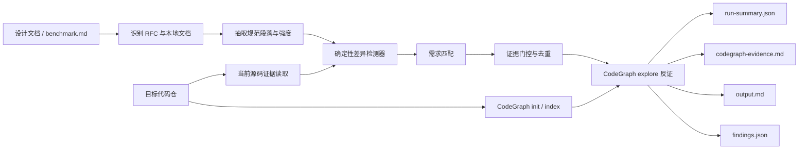

# SpecDiff Reviewer：设计与代码实现差异检测方案

## 一句话介绍

SpecDiff Reviewer 是一个面向 ICT 技术大赛“AI 实现设计差异检测”赛题的无人值守审计工具。它把设计文档或 RFC 中的规范要求，与目标代码仓中的真实实现逐项对照，最终输出带规范原文、源码行号、调用关系、反证检查和置信度的差异报告。

本方案采用三层架构：

- **CodeGraph**：建立代码结构索引，分析符号、调用关系、影响面和可能的替代实现；
- **Python 证据引擎**：解析设计文档、抽取规范、发现差异候选、校验证据、分类去重并生成报告；
- **SpecDiff Skill**：规定 Agent 的审计流程、证据门槛和结果分类纪律。

整个正式流程只需要 Bash、Python 3.10+、Node.js/npm，不需要 JDK、Joern、Docker、Neo4j 或外部大模型 API。

## 1. 赛题要解决什么问题

真实软件项目经常出现“设计写了一套，代码实现成了另一套”的情况，例如：

- RFC 要求必须处理所有合法选项，代码却只处理前 10 个；
- 设计要求代理响应前加入随机延迟，代码却立即发送；
- 文档描述了某个协议能力，仓库中根本没有对应模块；
- 特定协议报文应该进入专用处理流程，却被前面的通用分支提前返回；
- 代码里留有“尚未实现”的注释，但仓库其他位置可能已经存在替代实现。

难点不只是搜索关键词。一个可靠结果还必须回答：

1. 规范原文是什么，属于 MUST、SHOULD 还是 MAY？
2. 该规范在什么条件下适用于当前实现？
3. 代码实际执行了什么行为？
4. 是否存在其他调用路径、包装函数或替代实现，能够推翻当前结论？
5. 证据是否仍然对应当前源码的准确行号？
6. 多个表面现象是否其实来自同一个根因？

因此，本方案的核心不是“尽量多报问题”，而是建立一条可复现、可解释、可反证的证据链。

## 2. 总体架构



架构上刻意区分两类能力：

- CodeGraph 负责“代码之间有什么结构关系”；
- Python 引擎负责“规范是什么意思、证据是否成立、结果应该如何分类”。

`EvidenceReader` 只读取当前文件并复核精确行号，不建立第二套代码图，也不替代 CodeGraph。

## 3. 目录结构

```text
submission/
├── README.md                         # 团队分享与总体说明
├── INSTRUCTION.md                    # 裁判环境执行说明
├── TECHNICAL_REPORT.md               # 技术方案与验收报告
├── logs/
│   ├── validation.md                 # 验证记录
│   └── validation-summary.json       # 机器可读验证摘要
├── result/
│   ├── findings.json                 # 机器可读正式结果
│   ├── output.md                     # 人类可读正式报告
│   ├── codegraph-evidence.md         # CodeGraph 查询与原始图证据
│   └── run-summary.json              # 本次运行状态与统计
└── work/
    ├── setup.sh                      # 安装固定版本 CodeGraph
    ├── run.sh                        # 正式无人值守入口
    ├── skills/specdiff-review/       # Agent 审计 Skill 与证据规则
    └── specdiff/
        ├── cache/                    # 离线 RFC 正文缓存
        ├── schemas/                  # findings.json Schema
        ├── specdiff/                 # Python 实现
        └── tests/                    # 公开基准与自建测试
```

## 4. 从输入到结果的完整步骤

### 步骤 1：准备可复现运行环境

执行：

```bash
bash work/setup.sh
```

核心技术：

- 使用 npm 官方包 `@colbymchenry/codegraph@1.4.1`；
- 通过 `--save-exact` 固定版本，避免依赖自动升级造成结果漂移；
- 安装到 `work/.runtime/` 私有目录，不需要全局 npm 权限；
- 使用 `--no-audit --no-fund` 减少比赛环境中的额外交互和网络请求；
- 安装后立即检查 CodeGraph 可执行文件、输出版本，并编译检查 Python 包；
- 设置遥测关闭变量，避免分析过程发送不必要的数据。

成功标志是脚本退出码为 0，最后输出：

```text
SETUP_COMPLETE
```

`.runtime/` 是运行时依赖目录，不属于提交物。裁判首次执行时由 `setup.sh` 自动创建。

### 步骤 2：统一正式执行入口

执行入口只接收三个位置参数：

```bash
bash work/run.sh <代码仓路径> <设计文档路径> <输出目录>
```

例如：

```bash
ASSET=/app/code/judge-assets/01_03_ai_implementation_design_difference_detection

bash work/run.sh \
  "$ASSET/code/f-stack" \
  "$ASSET/Difference/benchmark.md" \
  "$PWD/result"
```

核心技术：

- Bash 使用 `set -euo pipefail`，任何失败都会产生非零退出码；
- 使用 `realpath` 固定输入路径，避免后续切换工作目录导致相对路径失效；
- 如果 CodeGraph 尚未安装，会自动调用 `setup.sh`；
- 正式运行强制使用 `--offline` 和 `--codegraph required`；
- 运行结束后检查关键结果文件是否存在且非空；
- 全程不需要人工输入，适合裁判平台无人值守执行。

成功标志为：

```text
RUN_COMPLETE output=<输出目录>
```

### 步骤 3：加载设计文档并补全 RFC

对应模块：`work/specdiff/specdiff/documents.py`。

核心技术：

1. 读取输入的单个设计文件或文档目录；
2. 从 benchmark 文本中识别 RFC 名称和引用链接；
3. 正式模式优先从 `work/specdiff/cache/` 加载 RFC 正文；
4. 通过文档名称和 SHA-256 内容摘要去重；
5. 缓存缺失时给出明确警告，不会把未知内容伪装成规范证据。

RFC 缓存解决了两个问题：

- 比赛运行时不依赖 IETF 网站是否可访问；
- 同一输入在不同时间运行时使用相同规范正文，结果更可复现。

### 步骤 4：抽取规范要求并判断强度

仍由 `documents.py` 完成。

引擎按 RFC 的章节和段落结构切分文本，过滤页眉、页脚和页码，并抽取包含规范关键词或协议行为的段落。每条要求保存：

- 文档名与本地来源路径；
- RFC 章节；
- 原文所在行；
- 规范完整段落；
- 稳定 ID；
- 规范强度。

规范强度按照 RFC 2119/8174 语义分类：

| 强度 | 典型关键词 | 处理原则 |
|---|---|---|
| `must` | MUST、SHALL、REQUIRED | 缺失或冲突通常属于强制规范问题 |
| `must_not` | MUST NOT、SHALL NOT | 代码启用被禁止行为时属于强冲突 |
| `should` | SHOULD、RECOMMENDED | 需要评估是否存在合理例外 |
| `should_not` | SHOULD NOT | 需要证明实现确实采用了不推荐行为 |
| `may` | MAY、OPTIONAL | 缺失只能称为可选能力缺口，不能称为违规 |
| `informative` | 说明性文字 | 只能用于上下文，不能单独支撑规范冲突 |

这一步防止把所有文档语句都错误地当成强制要求。

### 步骤 5：用 CodeGraph 建立代码结构索引

对应模块：`work/specdiff/specdiff/engine.py`。

首次分析目标仓库时执行：

```text
codegraph init <repo> --force
```

目标仓已经存在 `.codegraph` 时执行：

```text
codegraph index <repo> --force --quiet
```

核心技术：

- 直接调用官方 CodeGraph CLI，不维护自定义兼容适配器；
- 索引用于理解符号、调用者、被调用者、包装路径和影响面；
- 子进程有明确超时，stdout/stderr 都会被捕获；
- 正式模式中 CodeGraph 不可用或建图失败会直接终止，避免输出“看似完整但缺少图验证”的报告；
- 设置 `CODEGRAPH_TELEMETRY=0`、`DO_NOT_TRACK=1` 和 `CODEGRAPH_NO_DAEMON=1`。

CodeGraph 在这里不是简单的全文搜索工具，它主要解决“另一个文件里是否已经实现”“这个函数是否真实可达”“是否存在绕过当前分支的替代路径”等结构问题。

### 步骤 6：读取当前源码并生成精确证据

对应模块：`work/specdiff/specdiff/evidence_reader.py`。

核心技术：

- 只扫描常见源码和配置扩展名；
- 排除 `.git`、`.codegraph`、`node_modules`、构建目录和缓存目录；
- 默认跳过超过 2 MB 的单文件及二进制文件；
- 统一记录仓库相对路径、绝对路径、文本和行数组；
- 根据源码位置向上定位所属函数或文件作用域；
- 生成带行号的上下文摘录；
- 输出前重新读取磁盘文件，确认摘录、起止行和当前源码完全一致。

最后一项叫作“证据漂移校验”。如果检测期间文件发生变化，旧行号证据会被拒绝，而不是继续写入正式报告。

### 步骤 7：运行确定性差异检测器

对应模块：`work/specdiff/specdiff/detectors.py`。

当前检测器覆盖以下核心模式：

| 检测模式 | 典型实现问题 | 关键证据 |
|---|---|---|
| 固定低上限 | 只处理集合前 N 个元素 | 常量、循环计数、`break`/`return` |
| 明确未实现 | TODO 或注释承认强制行为缺失 | 注释与可达控制流，并检查替代实现 |
| 命名常量错值 | 规范写 `MAX_RETRIES=3`，代码为 1 | 同名常量和数值对比 |
| MUST NOT 开关启用 | 规范禁止某能力，配置却打开 | 规范常量、开关赋值和使用位置 |
| 通用分支抢占 | 宽泛条件提前返回，遮蔽专用协议处理 | 分支顺序、报文类型和返回路径 |
| 事件—动作缺失 | 设计要求某事件触发动作，但调用点中不存在 | 事件常量、动作函数和全仓调用点 |
| 协议整体缺失 | 文档明确描述协议能力，仓库无相应实现 | 多组关键词、模块名和图反证 |

检测器先产生“候选”，不会立即把每个命中都当成正式问题。注释、关键词零命中或单个常量都只能作为线索，后面还要经过规范匹配和反证门控。

### 步骤 8：把代码候选匹配到准确规范

对应模块：`work/specdiff/specdiff/matching.py`。

核心技术：

- 对候选标题、标签、关键术语和规范段落进行分词；
- 去除常见停用词，并同时保留连字符、下划线拆分后的协议词；
- 使用词项交集计算基础相关度；
- 对已知协议主题加入 RFC、章节和关键锚点约束；
- 对关键语义组合进行额外加权，例如代理随机延迟和 IPv6 扩展头顺序；
- 匹配分数低于门槛的候选不进入正式结果。

这一阶段的目标是避免“代码现象是真的，但引用了错误 RFC 段落”的问题。

### 步骤 9：执行证据门控

证据规则位于 `work/skills/specdiff-review/references/evidence-gate.md`。

每个候选必须同时通过八项检查：

1. **文档身份**：文档、章节、来源和段落准确；
2. **规范含义**：正确区分 MUST、SHOULD、MAY 和说明性文本；
3. **适用性**：说明什么输入或运行条件会触发问题；
4. **实际行为**：展示真实分支、调用、常量或缺失处理；
5. **图反证**：检查调用者、被调用者、替代处理器、包装函数和特性开关；
6. **可复现位置**：包含相对路径、行号、符号和当前摘录；
7. **根因去重**：同一要求与同一根因只保留一个结果；
8. **置信度**：低于 70% 的候选不进入正式结果。

此外还有两项重要约束：

- 通用硬上限只有在设计文档明确出现对应常量或存在协议专用规则时才保留；
- “仓库里没有实现”的负向结论不能只靠零次关键词命中，必须组合多个名称、常量、调用点和 CodeGraph 结果。

### 步骤 10：使用 CodeGraph 做逐项反证

通过证据门控后，引擎针对每个正式候选调用一次 `codegraph explore`。查询会包含：

- 问题标题；
- 起始源码文件；
- 起始符号；
- 调用者和相关调用路径；
- 替代实现或能够推翻结论的反证目标。

查询示意：

```text
Trace the implementation and all relevant callers for <finding>.
Start from <file> symbol <symbol>.
Look specifically for an alternative implementation or counterevidence
that would make the suspected design-to-code difference invalid.
```

核心思想是“主动寻找自己可能错在哪里”。如果存在另一条符合规范的真实路径，候选应该被抑制，而不是为了命中率继续报告。

原始查询与 CodeGraph 返回内容保存到 `result/codegraph-evidence.md`，便于团队复核。

### 步骤 11：分类、去重并生成结果

正式结果采用以下分类：

| 类型 | 含义 |
|---|---|
| `normative_contradiction` | 可达代码与 MUST、MUST NOT 或 SHOULD 等规范相冲突 |
| `optional_capability_gap` | MAY/OPTIONAL 能力未实现，不表述为标准违规 |
| `feature_gap` | 文档描述的功能或协议整体缺失，但不声称普遍强制合规 |
| `functional_misrouting` | 分支顺序或分发逻辑让输入进入了错误处理路径 |

相同规范、相同主题和相同根因的候选会合并。未通过规范匹配、精确证据、置信度或反证检查的候选计入 `suppressed`，但不会污染正式问题列表。

最终生成四个文件：

| 文件 | 用途 |
|---|---|
| `findings.json` | 自动评分和二次处理的主文件，结构遵循 JSON Schema |
| `output.md` | 团队和评委直接阅读的差异报告 |
| `codegraph-evidence.md` | 每个问题的图查询与原始反证材料 |
| `run-summary.json` | 输入、耗时、文件数、规范数、候选数、结果数和 CodeGraph 状态 |

`findings.json` 中每个问题都包含稳定 ID、分类、严重程度、置信度、规范原文、实际行为、适用条件、源码路径、精确行号、符号、证据链和反证记录。

## 5. 本赛题公开基准结果

正式分析只使用 `code/f-stack`、`Difference/benchmark.md` 和离线 RFC，没有把 `Difference/issues` 当作分析输入。

| # | 标签 | 结果类型 | 核心结论 |
|---|---|---|---|
| 1 | `nd-option-limit` | 规范冲突 | ND 选项处理被固定上限 10 提前截断 |
| 2 | `proxy-random-delay` | 规范冲突 | 代理 NA 没有按建议加入随机延迟 |
| 3 | `proxy-unsolicited-na` | 可选能力缺口 | 未发现代理配置变化触发 unsolicited NA 的实现 |
| 4 | `ipv6-fragment-chain` | 规范冲突 | 分片判断未按扩展头链的严格顺序处理 |
| 5 | `dhcpv6-absent` | 功能缺口 | 仓库不支持有状态 DHCPv6 |
| 6 | `mld-misrouting` | 功能路由错误 | MLD 报文被通用二层组播分支提前截获 |

验收结果：6 个公开主题全部识别，正式问题数恰好为 6，CodeGraph 建图成功，6/6 问题都完成 `explore` 反证。

## 6. 自建题与泛化能力

为了避免只针对公开样例硬编码，测试集额外覆盖：

- 命名常量与规范值不一致；
- 通用循环硬上限和提前退出；
- 强制行为存在明确 TODO；
- 通用组播分支遮蔽 IPv6 专用处理；
- MUST NOT 禁止开关被启用；
- MAY 能力缺失的负向样例；
- 规范与代码一致时不应报告；
- 存在真实替代实现时抑制 TODO 候选；
- 文件变化后拒绝已经漂移的旧证据。

运行测试：

```bash
cd work/specdiff
python3 -m unittest -v tests.test_public_benchmark tests.test_synthetic
```

当前 7 个测试方法全部通过。测试模式允许关闭 CodeGraph，用于快速隔离验证规范解析、检测器、门控和报告层；正式 `run.sh` 仍然强制要求 CodeGraph。

## 7. 性能、依赖与安全边界

本机已测数据：

- 规范与证据层完整回归约 30 秒；
- 完整 CodeGraph 基准集成约 236 秒；
- 远低于比赛 6 小时上限；
- Python 运行部分只使用标准库；
- 首次安装大约下载 200–250 MB npm 依赖，之后复用私有运行时目录。

安全与可复现措施：

- 固定 CodeGraph 版本；
- RFC 正文离线缓存；
- 禁用遥测和后台 daemon；
- 不要求 Git 历史；
- 不读取 benchmark 的答案目录作为正式输入；
- 不依赖外部大模型服务；
- 命令失败时输出非零退出码和单行 JSON 错误信息。

## 8. 已知边界

静态分析无法完整证明以下运行时行为：

- 反射和动态加载；
- 运行时生成代码；
- 仓库外部服务负责的逻辑；
- 编译宏、平台配置和部署参数构成的所有组合；
- CodeGraph 当前语言支持范围之外的结构关系。

因此，报告结论严格限定在输入源码和设计文档范围内。对于“未实现”类问题，工具会尽可能寻找替代路径，但仍建议团队在发布前结合具体构建配置做一次人工复核。

## 9. 团队快速讲解版本

向团队介绍时，可以用下面这段话概括：

> 我们先用固定版本的 CodeGraph 给代码建结构索引，再用 Python 从设计文档和 RFC 中抽取带强度的规范要求。确定性检测器在源码里寻找硬上限、错误常量、未实现行为、分支抢占和协议缺失等差异候选。每个候选都必须通过文档身份、适用条件、精确行号、置信度和根因去重检查，随后再让 CodeGraph 主动寻找调用路径、替代实现和反证。只有无法被反证推翻的候选才进入最终 JSON 和 Markdown 报告。这样既能找到问题，也能说明为什么它是问题、在哪里、依据是什么，以及我们检查过哪些可能的反例。

如果团队成员要继续扩展方案，推荐顺序是：

1. 在 `detectors.py` 增加一种可解释的差异模式；
2. 在 `tests/test_synthetic.py` 同时增加正向题和负向题；
3. 确认候选能够匹配到准确规范，而不是只命中关键词；
4. 保证输出前仍经过证据漂移校验和 CodeGraph 反证；
5. 最后运行公开基准，确认没有为了新增能力引入额外误报。

## 10. 相关文档

- [裁判执行说明](INSTRUCTION.md)
- [完整技术报告](TECHNICAL_REPORT.md)
- [验证记录](logs/validation.md)
- [机器可读验证摘要](logs/validation-summary.json)
- [示例人类可读结果](result/output.md)
- [示例结构化结果](result/findings.json)
- [CodeGraph 反证记录](result/codegraph-evidence.md)

