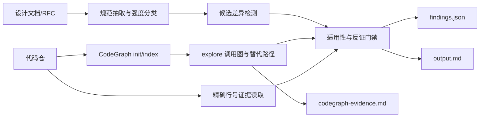

# SpecDiff Reviewer 技术报告

## 方案结论

作品采用“官方 CodeGraph + Python 证据引擎 + 平台 Skill”的单一最终方案：CodeGraph 负责结构化代码图、调用关系、影响面和替代路径；Python 标准库负责 RFC/设计文档解析、候选检测、规范强度、精确行号复核、反证门禁、去重和双格式报告；Skill 规定 Agent 的审计顺序与分类纪律。

CodeGraph 通过 npm 固定安装 `@colbymchenry/codegraph@1.4.1`，不捆绑二进制、不维护兼容适配器、不使用 Joern/JDK/数据库服务。安装与命令依据[官方 CodeGraph 仓库](https://github.com/colbymchenry/codegraph)。

## 数据流

`EvidenceReader` 不是第二套代码图：它不解析调用关系或持久化索引，只读取最终候选涉及的当前文件，验证行范围和摘录未漂移。正式流程中的结构检索和图反证直接调用官方 CodeGraph CLI。

## 检测与门禁

当前确定性检测器覆盖：

- 固定低上限导致集合提前退出；
- 注释明确承认尚未实现，但会检查替代实现；
- 规范命名常量与实现数值不同；
- MUST NOT 禁止的命名开关被启用；
- 宽泛分支提前返回，遮蔽后续特定协议分类；
- 规范事件—动作在全部调用点中缺失。

所有候选必须同时满足：文档身份、规范强度、适用条件、实际行为、当前源码证据、CodeGraph 反证、置信度不低于 70%、根因去重。`MAY` 缺失只能标记 `optional_capability_gap`，不能表述为标准违规；仓库完全缺少一个协议时标记 `feature_gap`。

## 公开基准结果

工具分析输入严格为 `code/f-stack` 与 `Difference/benchmark.md`，没有读取 `Difference/issues`。公开 6 项全部识别：

| # | 结果标签 | 类型 | 核心代码证据 |
|---|---|---|---|
| 1 | `nd-option-limit` | MUST 冲突 | `freebsd/netinet6/nd6.c` 固定 10 并提前 `break` |
| 2 | `proxy-random-delay` | SHOULD 冲突 | `nd6_nbr.c` 自述未实现，并直接输出 NA |
| 3 | `proxy-unsolicited-na` | MAY 能力缺口 | 枚举 NA 实际调用点，未见代理配置事件调用 |
| 4 | `ipv6-fragment-chain` | MUST 冲突 | DPDK helper 只检查固定 IPv6 头后的一个位置 |
| 5 | `dhcpv6-absent` | 功能缺口 | 代码自述不支持有状态 DHCPv6，仓库级反证检查 |
| 6 | `mld-misrouting` | 功能路由错误 | 二层组播先返回；后续 NDP 范围不含 MLD 130–132 |

真实集成验收状态：CodeGraph `1.4.1` 建图成功，6 个问题全部完成 `explore` 图反证。详细结果在 `result/`。

## 自建泛化与负向题

自建题没有复用公开问题文件，覆盖公开答案未直接考察的模式：

| ID | 题目 | 预期 |
|---|---|---|
| S1 | `MAX_RETRIES` 规范为 3、代码为 1 | 报命名常量错值 |
| S2 | `MAX_ENTRIES` 小上限加循环 `break` | 报通用提前退出 |
| S3 | 必须加密但代码留下明确 TODO | 报未实现强制行为 |
| S4 | 通用组播分支遮蔽 IPv6 特定处理 | 报分支抢占 |
| S5 | `DEBUG_BYPASS MUST NOT` 启用而代码设为 1 | 报禁止能力被启用 |
| N1 | 规范只说 MAY 发送心跳，代码未实现 | 不报告 |
| N2 | 规范和代码常量值一致 | 不报告 |
| N3 | 有 TODO，但仓库存在真实替代实现 | 通过反证抑制 |
| N4 | 修改/漂移的证据摘录 | 证据校验拒绝 |

`python -m unittest` 当前 7 个测试方法全部通过，公开测试断言正式结果恰好为 6，避免用额外误报凑数量。

## 性能与安全

- 规范/证据层全仓回归约 20–40 秒；
- 首次 npm 安装本机约 1–4 分钟，受网络影响；
- 首次完整 CodeGraph 基准约 236 秒；
- 不需要 Git 历史、JDK、Docker、外部模型 API；
- RFC 正文随作品缓存，正式运行使用 `--offline`；
- 设置 `CODEGRAPH_TELEMETRY=0`、`DO_NOT_TRACK=1`、`CODEGRAPH_NO_DAEMON=1`；
- 不读取公开 `issues` 目录作为分析输入。

## 已知边界

静态分析无法证明运行时反射、动态加载或仓库外服务的全部行为。因此报告明确限定到输入仓库；找不到实现不能仅依赖零次关键词命中，必须结合命名常量、调用点、CodeGraph 图结果及适用范围。无法通过门禁的候选进入 suppressed 计数，不写入正式问题列表。
